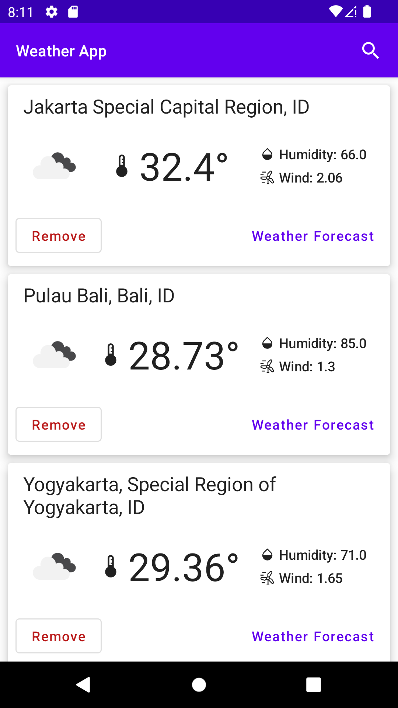
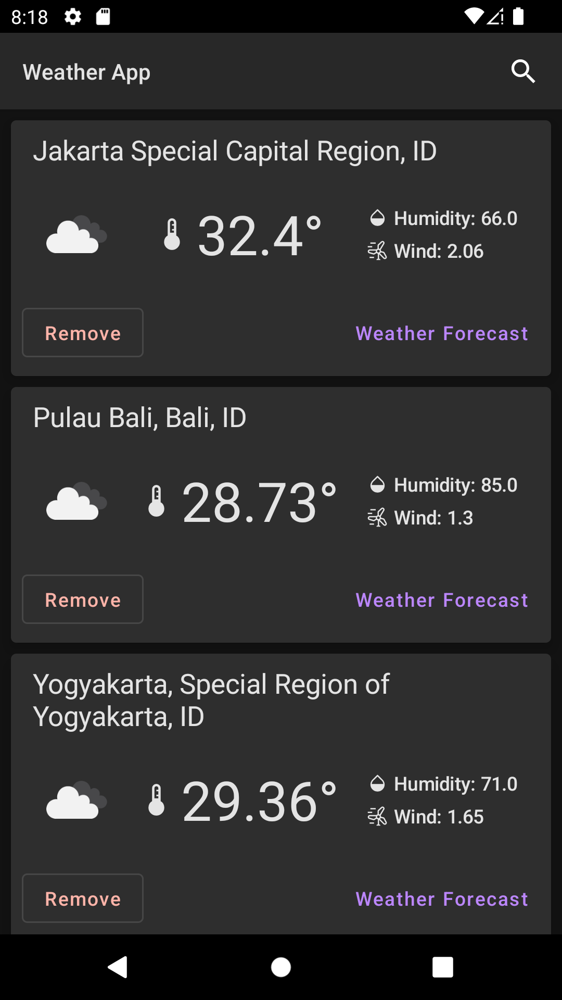

# Weather App

Weather App is a sample app to get current and daily weather forecast, built with
[Jetpack Compose](https://developer.android.com/jetpack/compose). 
It uses API from [OpenWeathermap](https://openweathermap.org).

To try out this sample app, you need [Android Studio](https://developer.android.com/studio).

## Getting Started

1. **Get an API Key**: Sign up at [OpenWeatherMap](https://openweathermap.org/api) and obtain your free API key.
2. **Clone the repository**:
   ```bash
   git clone https://github.com/untungs/weather-app.git
   ```
3. **Configure API Key**:
   - Open the project in Android Studio.
   - Locate the `local.properties` file in the root directory.
   - Add your API key there:
     ```properties
     API_KEY=YOUR_OPENWEATHER_API_KEY_HERE
     ```
4. **Build and Run**: The app uses the **Secrets Gradle Plugin** to automatically inject the key into the build config.

## Screenshots

| Light Theme                                                                | Dark Theme                                                               |
|:---------------------------------------------------------------------------|--------------------------------------------------------------------------|
|   |  |

# Architecture

The Weather App follows the [official architecture guidance](https://developer.android.com/topic/architecture).

The architecture follows a reactive programming model with [unidirectional data flow](https://developer.android.com/jetpack/guide/ui-layer#udf).
The data flow is achieved using streams, implemented using [Kotlin Flows](https://developer.android.com/kotlin/flow).

### Example: Displaying weather forecast of a location

When user run the app the first time, Home screen is still empty and user need to add location which can be found
by searching the name location. After a location is found user can select it and the app will open Weather Forecast 
screen. From this screen user can press Favorite button to keep it listed in Home screen.
User can click the location card on Home screen to navigate to Weather Forecast screen directly.

1. Location card calls `navController.navigateToWeatherDaily` through lambda function.
2. App navigate to `WeatherDailyRoute` and `WeatherDailyViewModel` received latitude & longitude parameters through `SavedStateHandle`.
3. In ViewModel, latitude & longitude data are used to retrieve the current weather and 5-day forecast using `WeatherRepository`, which in turn calls the `NetworkDataSource` (implemented using `Retrofit`).
   - Note: The app currently uses the `/data/2.5/weather` and `/data/2.5/forecast` endpoints.
4. Latitude & longitude are data also used to check whether this location is favorite by querying the data in local database using `Room` library.
5. Data from network and from local database are combined into `WeatherUiState` flow which contain the following data 
   1. Location name
   2. Current weather and daily weather forecast
   3. A boolean to mark the location as favorite or not, it is favorite if the latitude & longitude data is stored in Room
6. `WeatherUiState` is collected as Compose State to be displayed as Composable views.
7. When user toggle the favorite button, ViewModel tells Room to insert/delete location data.
8. Room automatically sends updated flow item and the process repeated from step 4.

### Libraries Used

1. Jetpack Compose
2. Jetpack Compose Navigation
3. ViewModel
4. Hilt for Dependency Injection
5. Coil Compose for image loading
6. Room for local database
7. Retrofit for networking with remote server
8. Cashapp Turbine for unit testing with Kotlin Coroutine